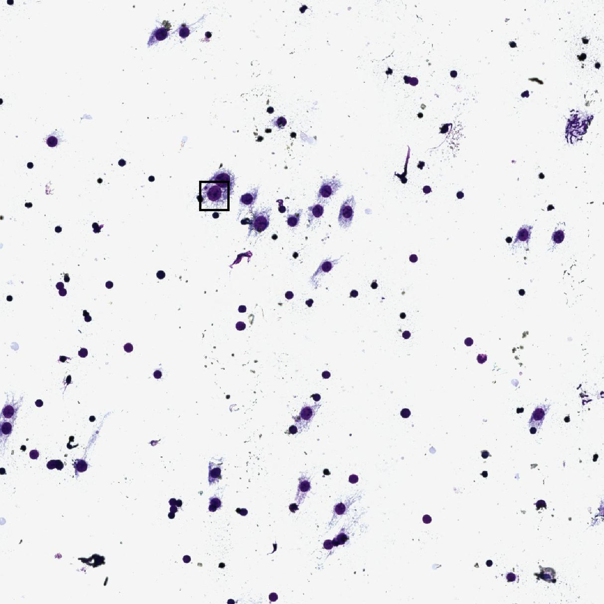
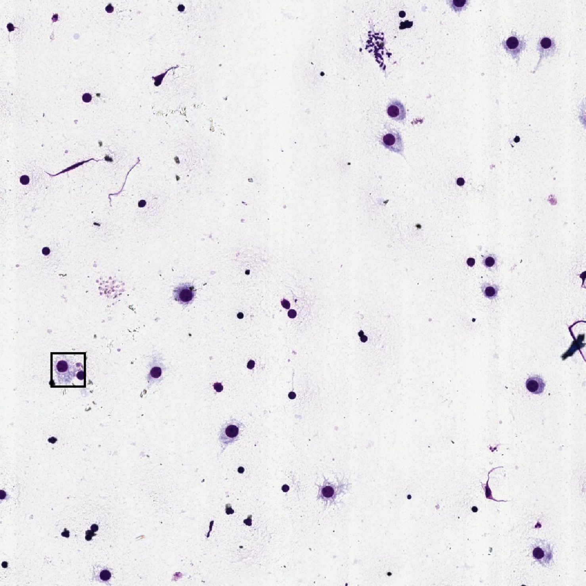
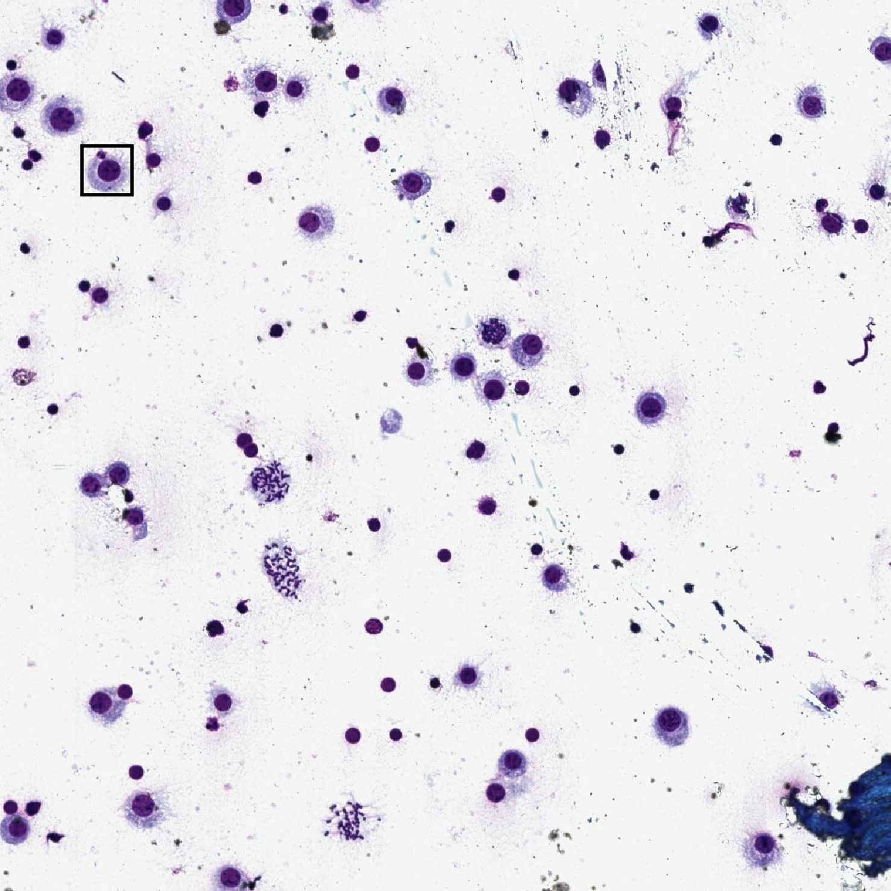

# Micro-Nucleus Detection 

## Method 
1. Using the [YOLO-v3](https://github.com/eriklindernoren/PyTorch-YOLOv3) for detection of all cells.
2. Using the [EfficientNet-b2](https://github.com/lukemelas/EfficientNet-PyTorch) for classification of cell types .

p.s. Using this separated 2-step detection rather than the end-2-end RCNN workflow for better
finetuning model and modifying dataset.

## File Tree
**cls_m[0-5]_*** is files for the classification workflow step 0 to 5.  
**train.py** is the YOLO train code.  
**detect.py** is the YOLO single image visualization code.  
**test.py** is the YOLO performance evaluation code.  
**[train|validation]_list.txt** is the train|validation data list.    

## Result

  

