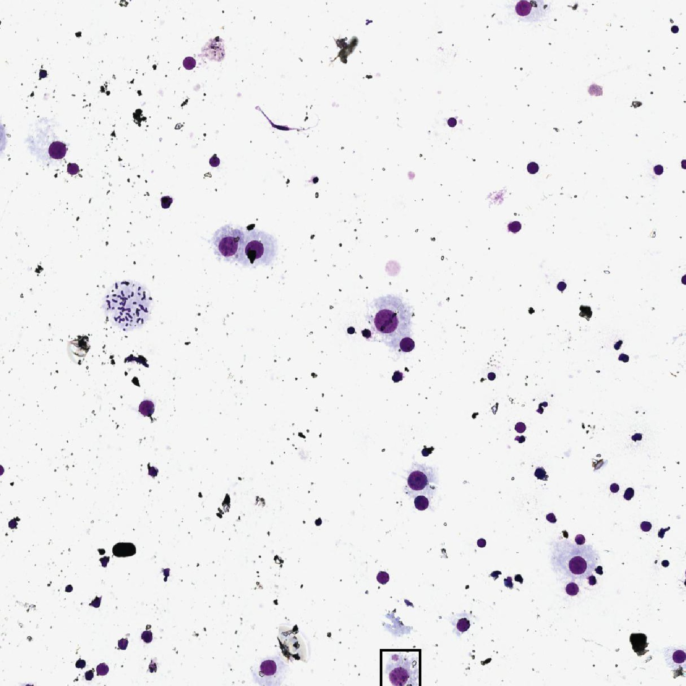

# Micro-Nucleus Detection 

## Method 
1. Using the [YOLO-v3](https://github.com/eriklindernoren/PyTorch-YOLOv3) for detection of all cells.
2. Using the [EfficientNet-b2](https://github.com/lukemelas/EfficientNet-PyTorch) for classification of cell types .

p.s. Using this separated 2-step detection rather than the end-2-end RCNN workflow for better
finetuning model and modifying dataset.

## Result

  

